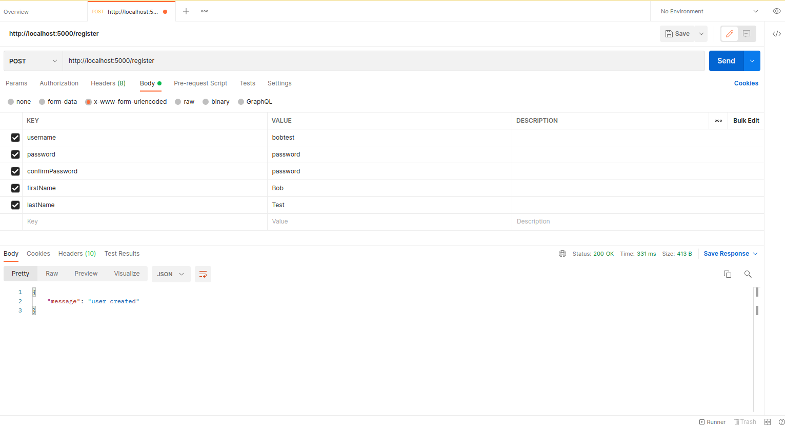
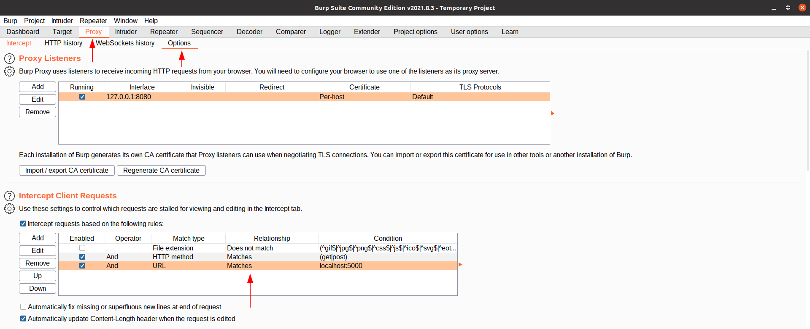
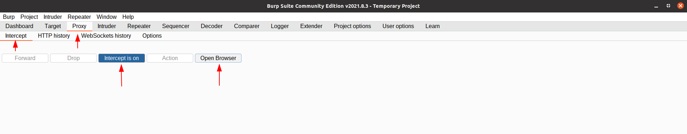
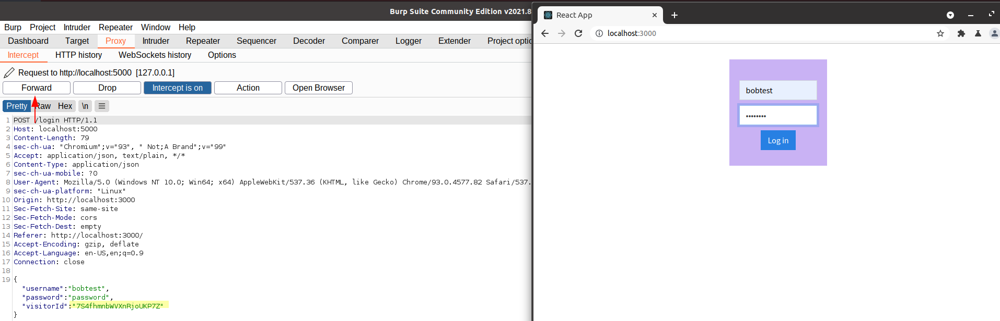

<div id="top"></div>

<br />
<div align="center">
  <a href="https://fingerprintjs.com/">
    
  </a>

  <h3 align="center">Fingerprint Js Pro Demo</h3>

<p align="center">
    Integrations Engineer Take Home Assignment from FingerprintJS
    <br />
  </p>
</div>


### About The Project

This a simple how FingerprintJS Pro API can be used to protect login functionality against credential stuffing. In the repository both server side code and client side code are included. Please scroll down or click [Demo Section](#demo) to see screenshot of a hypothetical malicious actor attempting to fuzz visitor id.

### Built With

* [React.js](https://reactjs.org/) 
* [Fingerprint.js Pro](https://fingerprintjs.com/) 
* [Express](https://expressjs.com/)
* [Axios](https://www.axios.com/)
* [Bootswatch](https://bootswatch.com/)
* [bcrypt](https://www.npmjs.com/package/bcrypt)
* [Sequelize](https://sequelize.org/)
* [sqlite3](https://www.npmjs.com/package/sqlite3)
* [nodemon](https://nodemon.io/)
* [Concurrently](https://www.npmjs.com/package/concurrently)

### Built On

* Ubuntu 20.04 
* Node Version 14.18.1
* npm 8.2.0

### Tools used to run demo
 
* [Postman](https://www.postman.com/) I didn't create gui front end for the register form. Screenshots are be included how to make a rest call to the backend api to create a new user account
 
* [Burp Suite Community Edition](https://portswigger.net/burp/communitydownload) To perform fuzzing of the visitorId. Screenshots are included on what filters to set to intercept request from the backend api.
 
### Installation
 
1. Clone repo
 
2. Install npm packages for both server and client
 
```sh
cd <project-root>
npm i
cd client/gui
npm i
```
 
3. There are two .env file in this project.
 
One for the server application in the project-root. That contains the values of the API KEY and the name of the sqlite database file path. Please change values accordingly to your environment/setup. The other .env is in client/gui. Please change BROWSER_API_KEY value according to your environment/setup.
 
4. Run Project. Make sure you navigatate back to the project-root folder. npm start on using nodemon and Concurrently to run both the server and client simultaneously. The application should be accessible via localhost:3000. The gui proxies request to the server application on localhost:5000.\
```sh
project-root> npm start
```
 
5. Download and install both Postman and Burpsuite from respective websites. There are many other alternative applications and plugins out there to accomplish the same tasks. I will include settings/parameters if you decide to use a different application.
 
### Demo
 
1. Once you run npm start. The application will create the sqlite file with the necessary tables. Please note if interrupt/kill the application and rerun all tables value be dropped.
 
2. Use postman we will create a new user.
 
Setting for Postman:
 
* Url: http://localhost:5000/register
* HTTP method: POST
* Content-Type: x-www-form-urlencoded
* Body params: username, password, confirmPassword, first, lastName,
 

 
3. To run the demo I used the browser integrated into burpsuite. To setup burpesuite to interpret the post request. Go to Proxy > Options > Intercept Client Request. Add a filter to look for packet that contains destination url of localhost:5000.
 

 
4. To start the burp suite browser to intercept request. Go to Proxy > Intercept > Open Browser
 

 
5. Once you open the browser, navigate to react application via localhost:3000.
Make sure the Intercept On/Off is blue on the Burp Suite prior to entering your login credential into the sample application. Burp Suite should intercept the post request where the username, password, and visitorId can be modified and forwarded.
 

 
 
### Possible Test Cases with Message Responses
 
1. Fuzz visitor id, you will be presented with a message of: Unable to login, suspicious activity and/or interference with your login in attempt
 
2. If you enter the password incorrect or username incorrect you will be present with a message of Invalid credentials
 
3. Account will be locked for 5 minutes if you enter an incorrect password or fuzz visitor id within a 5 minute interval. You will be present with a message of: Account temporarily locked due too many failed login attempts
 
4. If you continue to enter an incorrect password or fuzz visitor id during the five minute lock your account will be locked for an additional 5 minutes.
 
5. If account lock expired after the five minutes and login with valid credentials with a legitimate visitor id. You will be greeted with the message: Successfully logged in.
 
### Acknowledgments
 
Thanks to Martin Makarsky for the interview and interest in my resume.